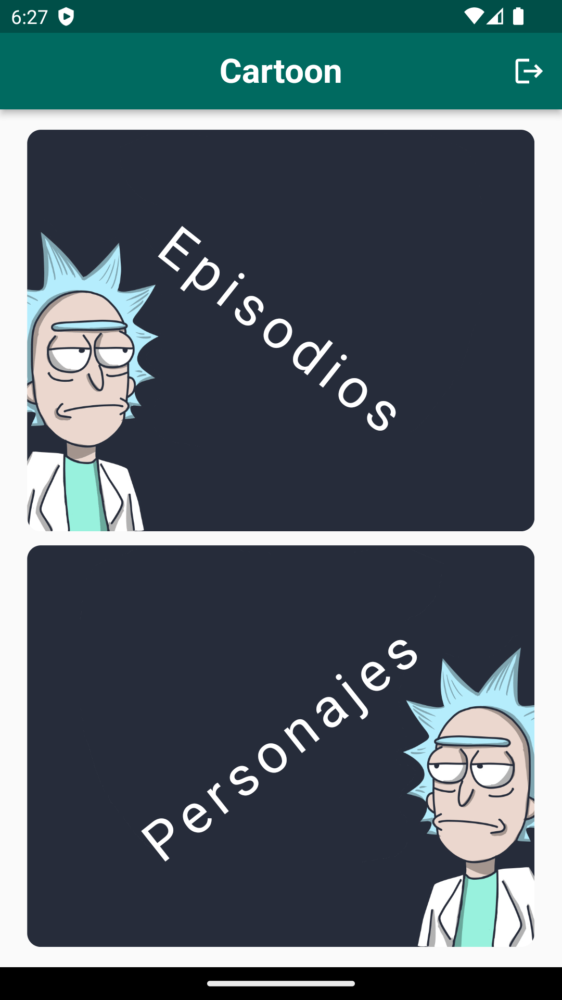
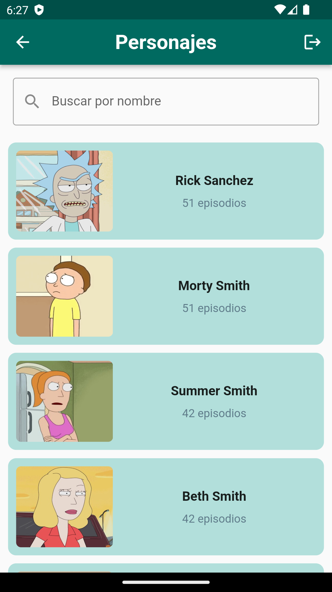

# Show Cartoon

Aplicación en Flutter de "Rick and Morty".

## Capturas de Pantalla

## Descripción

Esta aplicación usa el API del siguiente link `https://rickandmortyapi.com`, la cual tiene como objetivo principal obtener y desplegar información sobre el show de televisión llamado “Rick and Morty”.

## Login info

- Usuario: user
- Contraseña: 123456

## Instalación

1. Clona este repositorio: `git clone https://github.com/JustJaas/show_cartoon.git`
2. Navega a la carpeta del proyecto: `cd show_cartoon`
3. Instala las dependencias: `flutter pub get`

## Uso

1. Ejecuta la app en un emulador o dispositivo: `flutter run`
2. Utiliza los accesos brindados en "Login info"
3. Interactúa con la app y explora sus funcionalidades.
